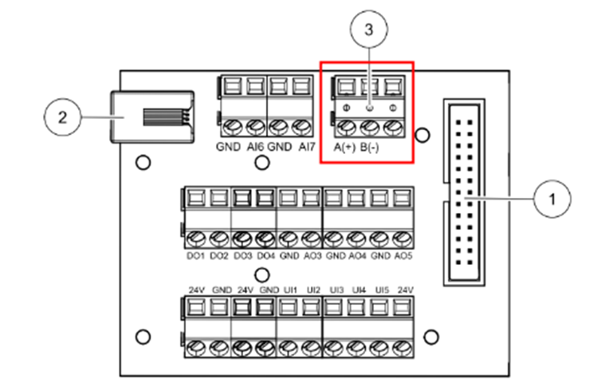

# Home Assistant – Systemair Modbus (SAVE)

> [Read this guide in English](README.en.md)

Dette er en **Home Assistant-integrasjon for Systemair SAVE-aggregater** med støtte for **Modbus TCP**.

Integrasjonen gir strukturert overvåking og styring av ventilasjonsaggregatet i Home Assistant, med fokus på **riktig luftmengde, energieffektiv drift og stabil entitetshåndtering**.

⚠️ **Merk:**  
Dette er et **uoffisielt community-prosjekt** og er ikke utviklet, støttet eller vedlikeholdt av Systemair.

---

## ✨ Funksjoner

### Ventilasjon og drift
- Visning av faktisk drift basert på aggregatets innstillinger
- Temperaturer (ute, tilluft, avtrekk, ettervarme m.m.)
- Viftehastigheter og driftsstatus
- Varmegjenvinning
- Filterstatus og alarmer

### Energi og effektivitet
- **Eco-modus**
- Behovsstyring (der aggregatet støtter dette)
- Borte- og Ferie-modus
- Energieffektiv drift basert på belastning og konfigurasjon i aggregatet

### Komfort
- **Frikjøling (Free cooling)** når betingelser er oppfylt
- Party- og Boost-modus
- Manuell hastighetsstyring (Lav / Normal / Høy)

### Brukeropplevelse
- Norsk og engelsk språk (følger Home Assistant-språk)
- Konsistente og stabile entiteter
- Innebygde **buttons** for vanlige handlinger
- Robust håndtering av midlertidig bortfall av Modbus-forbindelse

---

## 📋 Systemair SAVE – støttede modeller
 
**Luftmengde-estimat (m³/h)** er kun tilgjengelig for modeller som er eksplisitt definert i koden.

**Forklaring:**
- ✅ = Ja / tilgjengelig  
- ⚙️ = Støttet, men ikke testet  
- ❌ = Ikke tilgjengelig  

> Har du testet integrasjonen med en modell som ikke er markert som testet?  
> Gi gjerne beskjed via Issue, så kan listen oppdateres.

| Serie | Modell / Type | Modbus-støtte | Luftmengde-estimat (m³/h) | Testet |
|-------|---------------|---------------|---------------------------|--------|
| VSR | VSR 150/B | ✅ | ✅ | ❌ |
| VSR | VSR 200/B | ✅ | ✅ | ❌ |
| VSR | VSR 300 | ✅ | ✅ | ❌ |
| VSR | VSR 400 | ✅ | ✅ | ❌ |
| VSR | VSR 500 | ✅ | ✅ | ❌ |
| VSR | VSR 700 | ✅ | ✅ | ❌ |
| VTR | VTR 100/B | ✅ | ✅ | ❌ |
| VTR | VTR 150/B | ✅ | ✅ | ❌ |
| VTR | VTR 250/B | ✅ | ✅ | ❌ |
| VTR | VTR 275/B | ✅ | ✅ | ❌ |
| VTR | VTR 350/B | ✅ | ✅ | ❌ |
| VTR | VTR 500 | ✅ | ✅ | ✅ |
| VTR | VTR 700 | ✅ | ✅ | ❌ |
| VTC | VTC 200–1 | ✅ | ❌ | ❌ |
| VTC | VTC 300 | ✅ | ❌ | ❌ |
| VTC | VTC 500 | ✅ | ❌ | ❌ |
| VTC | VTC 700 | ✅ | ❌ | ❌ |
| VSC | VSC 100 | ✅ | ❌ | ❌ |
| VSC | VSC 200 | ✅ | ❌ | ❌ |
| VSC | VSC 300 | ✅ | ❌ | ❌ |

---

## 🏗️ Forutsetninger – aggregat og luftmengde

Denne integrasjonen forutsetter at ventilasjonsanlegget er **korrekt prosjektert og dimensjonert**.

- Aggregatet må være valgt basert på reell luftmengde (m³/h)
- Luftmengder per sone må være riktig innregulert
- Home Assistant erstatter **ikke** ventilasjonsprosjektering

Integrasjonen bygger videre på aggregatets eksisterende konfigurasjon og gir:
- oversikt
- styring
- automasjon

Feil aggregatvalg eller feil luftmengder kan ikke kompenseres med programvare.

---

## 🖥️ Eksempel på Lovelace-kort

Bildet under viser et eksempel på et Lovelace-kort bygget manuelt i Home Assistant
ved hjelp av entiteter fra denne integrasjonen.

> Selve kortet følger **ikke** med integrasjonen og bygges fritt etter egne preferanser.

---

## 📦 Installasjon (HACS)

### Krav
- Home Assistant **2024.6** eller nyere
- Systemair SAVE med Modbus-tilgang
- Modbus TCP  
  - Innebygd i aggregatet **eller**
  - Via ekstern gateway (f.eks. Elfin EW11)
- HACS (Home Assistant Community Store)

### Installere integrasjonen
1. Gå til **HACS → Integrations**
2. Velg **Custom repositories**
3. Legg til dette repoet som **Integration**
4. Installer **Systemair Modbus**
5. Start Home Assistant på nytt
6. Gå til **Innstillinger → Enheter og tjenester → Legg til integrasjon**
7. Velg **Systemair Modbus** og fyll inn:
   - IP-adresse
   - Port (vanligvis `502`)
   - Modbus slave-ID

---

## ℹ️ Begrensninger og tekniske forhold

- **Trykkvakt (Pressure Guard)** er en intern sikkerhetsfunksjon i aggregatet  
  → vises kun som status (read-only)
- Ikke alle SAVE-modeller støtter full stopp via Modbus  
  → der full stopp ikke er tilgjengelig, benyttes lavest mulige hastighet
- Tilgjengelige funksjoner avhenger av aggregatmodell og konfigurasjon

---

## 🔌 Fysisk installasjon – Elfin EW11 (Modbus RTU → TCP)

Denne delen er kun relevant dersom aggregatet **ikke har innebygd Modbus TCP**.

### ⚠️ ADVARSEL
Koble alltid fra strømmen til ventilasjonsaggregatet før du åpner det.  
Er du usikker, kontakt kvalifisert fagperson.

### 1. Koble til Modbus på Systemair SAVE
Finn terminalen for ekstern kommunikasjon på hovedkortet, merket:
- `A(+)`
- `B(-)`
- `24V`
- `GND`

### 2. Koble Elfin EW11
Koble ledningene i henhold til skjemaet under:

---

### 3. Konfigurer Elfin EW11

1. Koble til Wi-Fi-nettverket `EW1x_...` (åpent nettverk)
2. Åpne web-grensesnitt: `http://10.10.100.254`
3. Logg inn med:
   - Bruker: `admin`
   - Passord: `admin`
4. Gå til **System Settings → WiFi Settings**
   - Sett **WiFi Mode** = `STA`
   - Koble til ditt hjemmenettverk
5. Restart enheten og sett **statisk IP**
6. Gå til **Serial Port Settings** og sett verdiene som vist:

7. Gå til **Communication Settings** og legg til Modbus-profil:

8. Under **Status** skal telleverk for datapakker øke:

Når dette fungerer, kan IP-adressen brukes direkte i Home Assistant-integrasjonen.

---

## 🙏 Anerkjennelser

Installasjonsveiledningen for Elfin EW11 (Modbus RTU → TCP) er basert på
arbeidet publisert på [domotics.no](https://www.domotics.no/), skrevet av
Mads Nedrehagen.

I tillegg har en KI-assistent blitt brukt som støtte til feilsøking,
refaktorering og forbedring av dokumentasjon under utviklingen av prosjektet.

Denne integrasjonen er **selvstendig utviklet** som en moderne Home Assistant-integrasjon.

---

## 📝 Lisens
MIT – se `LICENSE`.

