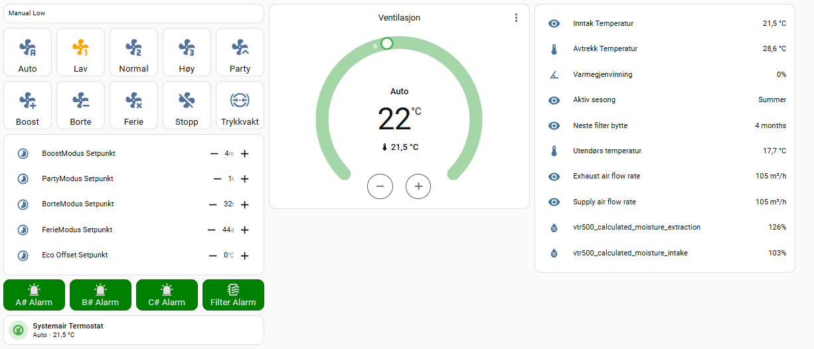

# Home Assistant – Systemair Modbus (SAVE / VTR)

> [Read this guide in English](README.en.md)

Dette er en **Home Assistant-integrasjon for Systemair SAVE / VTR-aggregater** via **Modbus TCP**.

⚠️ Dette er et uoffisielt community-prosjekt og er ikke utviklet, støttet eller vedlikeholdt av Systemair.

---

## ✨ Funksjoner

- Full overvåking av ventilasjonsaggregatet
  - Temperaturer, viftehastigheter, varmegjenvinning og alarmer
- Modus- og hastighetsstyring
  - Auto, Manuell (Lav / Normal / Høy), Party, Boost, Borte og Ferie
- Innebygde **trykk-knapper (buttons)** for vanlige handlinger
- **Trykkvakt (Pressure Guard)** vises som egen status (read-only sikkerhetsfunksjon)
- Norsk og engelsk brukergrensesnitt (følger Home Assistant-språket)
- Robust håndtering av midlertidig bortfall av Modbus-forbindelse

---

## 📦 Installasjon (HACS)

### Krav
- Home Assistant **2024.6** eller nyere
- Systemair SAVE / VTR med Modbus-tilgang
- Modbus TCP (innebygd eller via ekstern gateway)
- HACS (Home Assistant Community Store)

### Installere integrasjonen
1. Gå til **HACS → Integrations**
2. Velg **Custom repositories**
3. Legg til dette repoet som **Integration**
4. Installer **Systemair Modbus**
5. Start Home Assistant på nytt
6. Gå til **Innstillinger → Enheter og tjenester → Legg til integrasjon**
7. Velg **Systemair Modbus** og fyll inn:
   - IP-adresse
   - Port (vanligvis 502)
   - Modbus slave-ID

---

## ℹ️ Viktig informasjon

### Trykkvakt (Pressure Guard)
Trykkvakt er en **intern sikkerhetsfunksjon** i aggregatet og kan ikke manuelt aktiveres eller deaktiveres.
Integrasjonen viser kun om trykkvakt er **aktiv / ikke aktiv**.

### Stopp-funksjon
Ikke alle Systemair-aggregater støtter full stopp via Modbus.
Derfor kan **Stopp** være implementert som en *soft stop* (lav hastighet) der full stopp ikke er tilgjengelig.

---

## 🔌 Fysisk installasjon – Elfin EW11 (Modbus RTU → TCP)

Denne seksjonen er relevant **dersom aggregatet ikke har innebygd Modbus TCP** og du bruker en ekstern gateway, f.eks. **Elfin EW11**.

### ⚠️ ADVARSEL
Koble alltid fra strømmen til ventilasjonsaggregatet før du åpner det.  
Er du usikker, kontakt kvalifisert fagperson.

### 1. Koble til Modbus på Systemair VTR
Finn terminalen for ekstern kommunikasjon på hovedkortet, merket:
- `A(+)`
- `B(-)`
- `24V`
- `GND`

### 2. Koble Elfin EW11
Koble ledningene i henhold til skjemaet under:

---

### 3. Konfigurer Elfin EW11

1. Koble til Wi-Fi-nettverket `EW1x_...` (åpent nettverk)
2. Åpne web-grensesnitt: `http://10.10.100.254`
3. Logg inn med:
   - Bruker: `admin`
   - Passord: `admin`
4. Gå til **System Settings → WiFi Settings**
   - Sett **WiFi Mode** = `STA`
   - Koble til ditt hjemmenettverk
5. Restart enheten og sett **statisk IP**
6. Gå til **Serial Port Settings** og sett verdiene som vist:

7. Gå til **Communication Settings** og legg til Modbus-profil:

8. Under **Status** skal telleverk for datapakker øke:

Når dette fungerer, kan IP-adressen brukes direkte i Home Assistant-integrasjonen.

---

## 🙏 Anerkjennelser / Credits

## 🙏 Anerkjennelser

Installasjonsveiledningen for Elfin EW11 (Modbus RTU → TCP) er basert på
arbeidet publisert på [domotics.no](https://www.domotics.no/), skrevet av
Mads Nedrehagen.

I tillegg har en KI-assistent blitt brukt som støtte til feilsøking,
refaktorering og forbedring av dokumentasjon under utviklingen av prosjektet.

Denne integrasjonen er **selvstendig utviklet** som en moderne Home Assistant-integrasjon.

---

## 📝 Lisens
MIT – se `LICENSE`.

